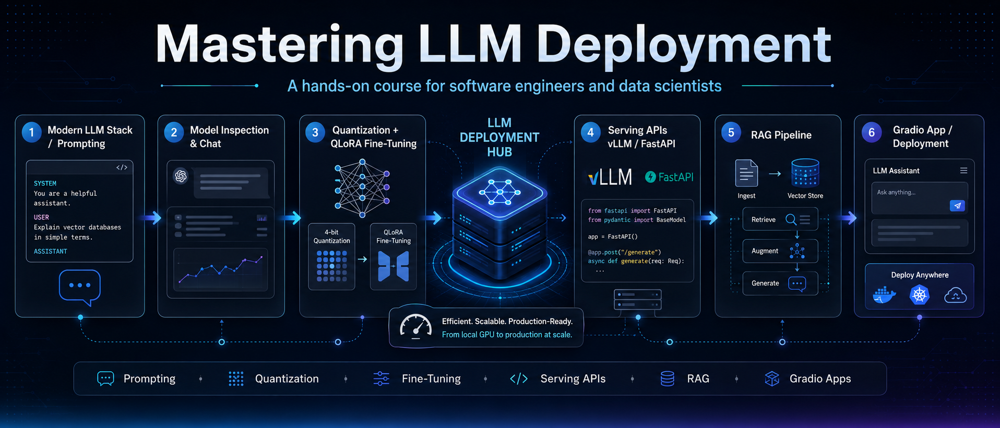

# Mastering LLM Deployment

A 2-day hands-on course for software engineers and data scientists on deploying Large Language Models efficiently and at scale.



## Course Objectives

- Understand the modern GenAI stack (HuggingFace, LangChain, OpenAI-compatible APIs)
- Write production-grade prompts: zero/few-shot, chain-of-thought, structured output, injection defense
- Inspect transformer model internals and manage multi-turn conversations
- Quantize models with bitsandbytes (NF4/INT4) and fine-tune with QLoRA
- Build and serve OpenAI-compatible APIs with FastAPI, understand vLLM at scale
- Build a full RAG pipeline with local embeddings, hybrid search, ChromaDB, and LLM-as-Judge evaluation
- Ship a streaming Gradio app backed by RAG

## Getting Started

### Google Colab (Recommended)

Click any **Open in Colab** badge below to launch a notebook directly. No local setup needed.

**You will need an OpenAI API key** (provided by the instructor) for Labs 1, 2, 5, 6, 7, and the Capstone. Store it as a Colab Secret — never paste it directly into a cell:
1. In Colab, click the **🔑 key icon** in the left sidebar
2. Click **+ Add new secret**, name it `OPENAI_API_KEY`, paste your key
3. Enable **Notebook access** for the toggle next to it

The notebooks load it automatically from Colab Secrets. Most notebooks also support a local `OPENAI_API_KEY` environment variable for instructor testing.

**Lab 5 also requires a free ngrok account** for the tunnel that exposes your server. Sign up at [ngrok.com](https://ngrok.com), copy your authtoken from the dashboard, and add it as a Colab Secret named `NGROK_AUTH_TOKEN`.

> **Enabling GPU for Lab 4 and Capstone Track B:**
> In Colab, go to **Runtime → Change runtime type → Hardware accelerator → T4 GPU → Save**, then re-run from the top.

### Local Setup

```bash
pip install -r requirements.txt
jupyter lab
```

## Lab Structure

| Lab | Topic | Duration | Hardware | Open in Colab |
|-----|-------|----------|----------|---------------|
| **Lab 0** — Environment Check | Verify all dependencies install and run | 10 min | CPU | [](https://colab.research.google.com/github/tatwan/mastering_llm_deployments/blob/main/00_Environment_Check/lab0_env_check.ipynb) |
| **Lab 1A** — Modern Stack | HuggingFace internals, OpenAI SDK, `base_url` swap, LangChain chains | 45 min | CPU | [](https://colab.research.google.com/github/tatwan/mastering_llm_deployments/blob/main/01_Modern_Stack/lab1_modern_stack.ipynb) |
| **Lab 1B** — Tool Calling + SQL Agent | Function/tool calling, ReAct mental model, SQL agent from scratch | 45 min | CPU | [](https://colab.research.google.com/github/tatwan/mastering_llm_deployments/blob/main/01_Modern_Stack/lab1_part2_tools_react_sql_agent.ipynb) |
| **Lab 2** — Prompting Fundamentals | Prompt anatomy, zero/few-shot, CoT, structured output, prompt injection defense | 45 min | CPU | [](https://colab.research.google.com/github/tatwan/mastering_llm_deployments/blob/main/02_Prompting/lab2_prompting.ipynb) |
| **Lab 3** — Inspect & Chat | Model architecture, tokenization, generation controls, multi-turn sessions | 45 min | CPU | [](https://colab.research.google.com/github/tatwan/mastering_llm_deployments/blob/main/03_Inspect_Chat/lab3_inspect_chat.ipynb) |
| **Lab 4** — Quantize + LoRA | INT4/NF4 quantization, LoRA mechanics, QLoRA fine-tuning | 75 min | **T4 GPU** ⚡ | [](https://colab.research.google.com/github/tatwan/mastering_llm_deployments/blob/main/04_Quantize_LoRA/lab4_quantize_lora.ipynb) |
| **Lab 5** — Serving API | FastAPI OpenAI-compatible server, ngrok tunnels, vLLM concepts | 45 min | CPU | [](https://colab.research.google.com/github/tatwan/mastering_llm_deployments/blob/main/05_Serving_API/lab5_serving_api.ipynb) |
| **Lab 6** — RAG Pipeline | Chunk → embed → retrieve → hybrid search → generate → RAGAS evaluation | 60 min | CPU | [](https://colab.research.google.com/github/tatwan/mastering_llm_deployments/blob/main/06_RAG_Pipeline/lab6_rag_pipeline.ipynb) |
| **Lab 7** — Gradio RAG App | Streaming Gradio app, partner red-team challenge | 45 min | CPU | [](https://colab.research.google.com/github/tatwan/mastering_llm_deployments/blob/main/07_Gradio_RAG_App/lab7_gradio_rag_app.ipynb) |
| **Capstone A** | Domain RAG Assistant | 3 hr | CPU | [](https://colab.research.google.com/github/tatwan/mastering_llm_deployments/blob/main/Capstone/capstone_track_a.ipynb) |
| **Capstone B** | Fine-Tuned Showcase | 3 hr | **T4 GPU** ⚡ | [](https://colab.research.google.com/github/tatwan/mastering_llm_deployments/blob/main/Capstone/capstone_track_b.ipynb) |

> ⚡ **Lab 4 and Capstone Track B require T4 GPU.** All other labs run on the free CPU runtime.

## Day Schedule

**Day 1**
- Pre-class: Lab 0 (environment check)
- AM: Lab 1A → Lab 1B → Lab 2 → Lab 3
- PM: Lab 4 (GPU required)

**Day 2**
- AM: Lab 5 → Lab 6
- PM: Lab 7 → Capstone

## Production Readiness Pack

The core two-day class is Labs 00-07 plus the Capstone. The labs below are optional mastery labs for students who want the full production deployment picture after class.

| Lab | Topic | Why It Matters | Open in Colab |
|-----|-------|----------------|---------------|
| **Lab 8** — Observability and Tracing | Request-level RAG traces, span timing, retrieved chunks, failure diagnosis | Explains why one deployed answer failed | [](https://colab.research.google.com/github/tatwan/mastering_llm_deployments/blob/main/08_Observability_Tracing/lab8_observability.ipynb) |
| **Lab 9** — Semantic Caching | Exact vs semantic cache, threshold tuning, false hits, cost/latency savings | Reduces repeated LLM calls safely | [](https://colab.research.google.com/github/tatwan/mastering_llm_deployments/blob/main/09_Semantic_Caching/lab9_semantic_caching.ipynb) |
| **Lab 10** — Containerization | Dockerfile, OpenAI-compatible FastAPI proxy, runtime secrets, cloud handoff | Packages the API for Cloud Run, ECS, App Runner, or Kubernetes | [](https://colab.research.google.com/github/tatwan/mastering_llm_deployments/blob/main/10_Containerization/lab10_docker.ipynb) |
| **Lab 11** — Guardrails and Security | Input guard, retrieval confidence gate, output redaction, attack reruns | Turns Lab 7 red-teaming into practical mitigation | [](https://colab.research.google.com/github/tatwan/mastering_llm_deployments/blob/main/11_Guardrails_Security/lab11_guardrails_security.ipynb) |
| **Lab 12** — Evaluation Regression | Golden dataset, deterministic checks, optional MLflow logging | Catches prompt/RAG regressions before deployment | [](https://colab.research.google.com/github/tatwan/mastering_llm_deployments/blob/main/12_Evaluation_Regression/lab12_evaluation_regression.ipynb) |

These labs connect directly to production evaluation practice: MLflow-style experiment tracking answers "which configuration is better?", while Lab 8 tracing answers "what happened inside this one bad request?"

## Key Dependencies

```
transformers torch bitsandbytes peft trl
openai langchain langchain-openai langchain-community
sentence-transformers chromadb bm25s
fastapi uvicorn pyngrok
gradio
ragas
litellm
```

See `requirements.txt` for pinned versions.

Production readiness labs install their own optional dependencies inside the notebooks so the core Day 1 setup stays lightweight.

## Bonus Labs

The core 00-07 sequence is designed to fit a 2-day workshop. Optional bonus labs extend the course into tool calling, LlamaIndex, agents, LLM gateways, and Hugging Face Spaces deployment. See [Bonus/README.md](Bonus/README.md).

## Prerequisites

- Python proficiency
- Basic ML/deep learning concepts
- No prior LLM deployment experience required
